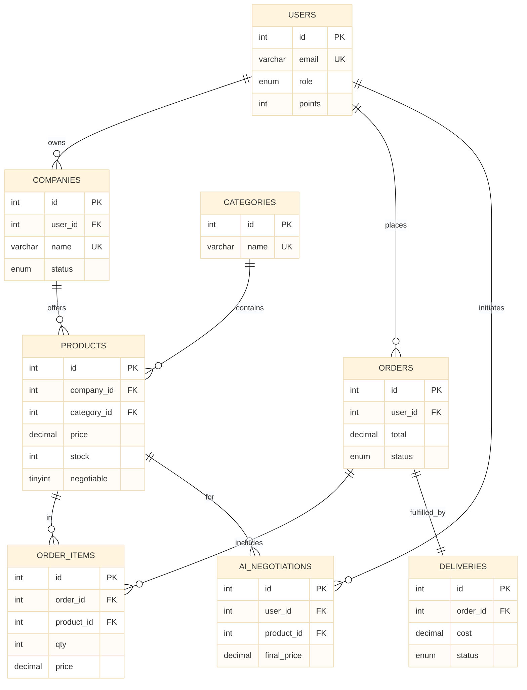
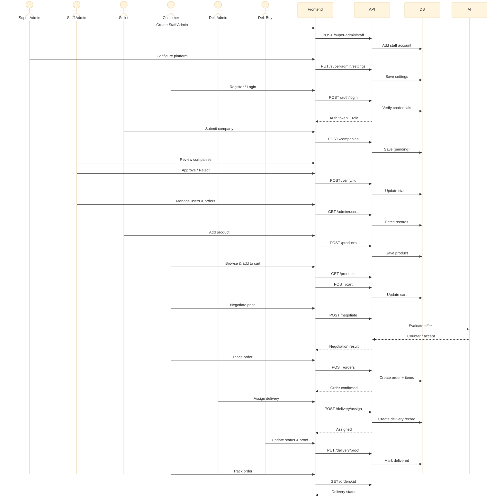
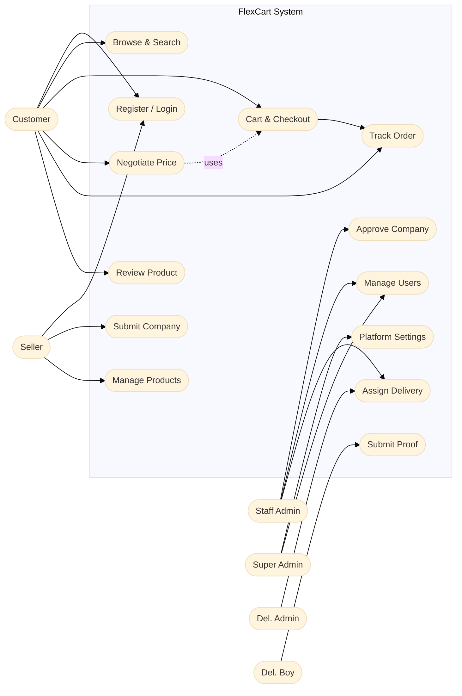
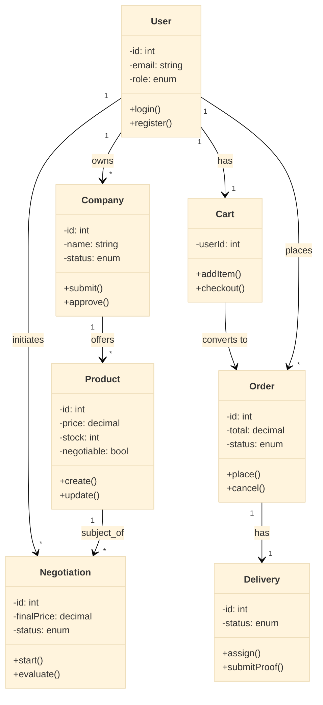
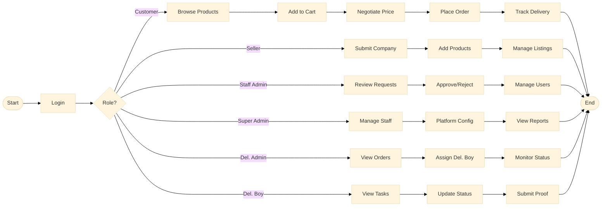
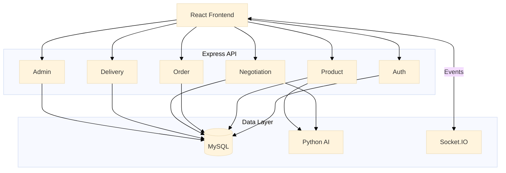
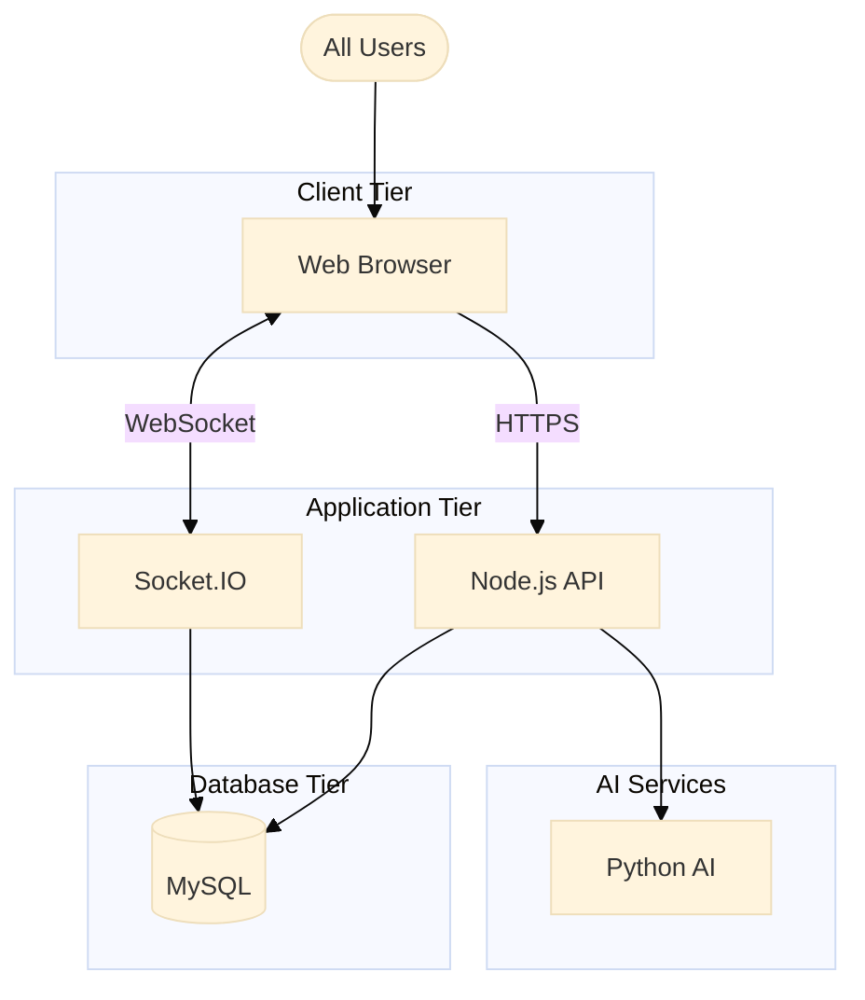
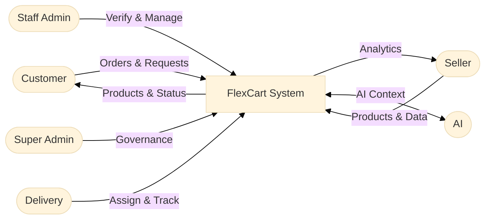
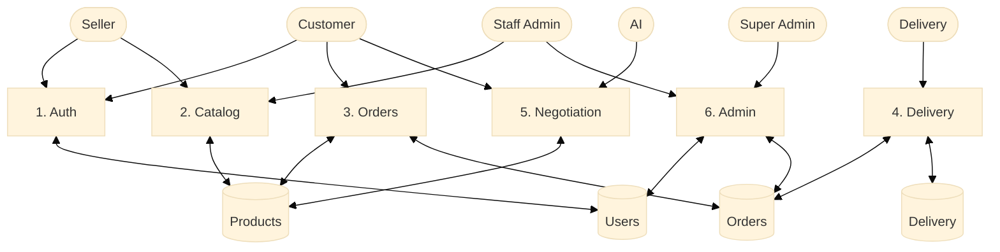
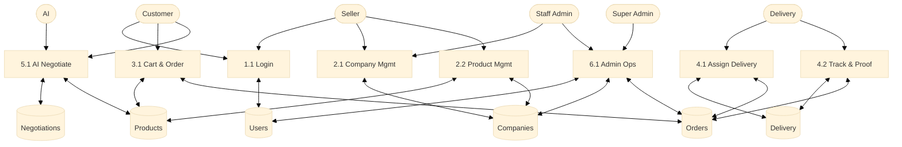

# FlexCart — Consolidated System Diagrams

> All diagrams use Mermaid syntax and are consolidated for report use.
> Only DFD remains separated into Level 0, Level 1, and Level 2.

---

## Table of Contents

1. [ER Diagram (Complete)](#1-er-diagram-complete)
2. [Sequence Diagram (Main Workflow)](#2-sequence-diagram-main-workflow)
3. [Use Case Diagram (Complete)](#3-use-case-diagram-complete)
4. [Class Diagram (Core Architecture)](#4-class-diagram-core-architecture)
5. [Activity Diagram (Main Flow)](#5-activity-diagram-main-flow)
6. [Component Diagram (Backend + AI + Frontend)](#6-component-diagram-backend--ai--frontend)
7. [Deployment Diagram (Production View)](#7-deployment-diagram-production-view)
8. [Data Flow Diagram - Level 0](#8-data-flow-diagram---level-0)
9. [Data Flow Diagram - Level 1](#9-data-flow-diagram---level-1)
10. [Data Flow Diagram - Level 2](#10-data-flow-diagram---level-2)

---

## 1. ER Diagram (Complete)

---

## 2. Sequence Diagram (Main Workflow)

---

## 3. Use Case Diagram (Complete)

---

## 4. Class Diagram (Core Architecture)

---

## 5. Activity Diagram (Main Flow)

---

## 6. Component Diagram (Backend + AI + Frontend)

---

## 7. Deployment Diagram (Production View)

---

## 8. Data Flow Diagram - Level 0

---

## 9. Data Flow Diagram - Level 1

---

## 10. Data Flow Diagram - Level 2

---

Generated for FlexCart Final Project (consolidated report version)
